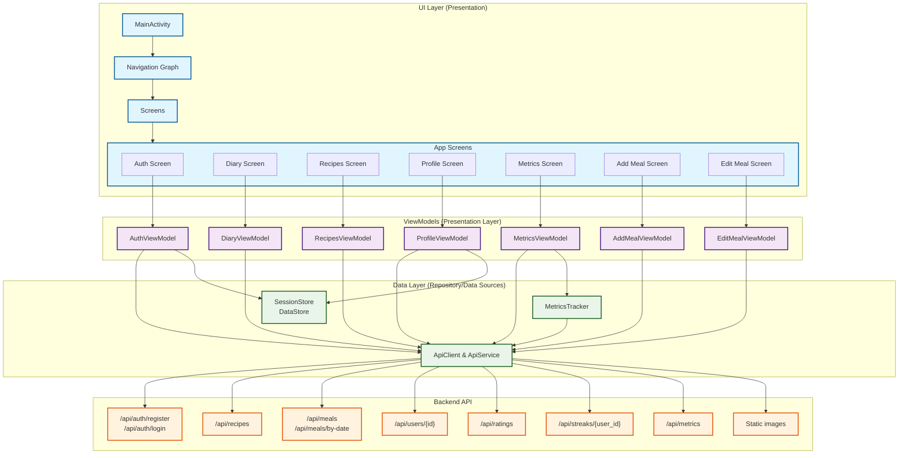

# Architecture

```mermaid
flowchart TB
  subgraph Screens["App Screens"]
    C1["Auth Screen"]
    C2["Diary Screen"]
    C3["Recipes Screen"]
    C4["Profile Screen"]
    C5["Metrics Screen"]
    C6["Add Meal Screen"]
    C7["Edit Meal Screen"]
  end
  subgraph UI["UI Layer (Presentation)"]
    A["MainActivity"]
    B["Navigation Graph"]
    C["Screens"]
    Screens
  end
  subgraph VM["ViewModels (Presentation Layer)"]
    V1["AuthViewModel"]
    V2["DiaryViewModel"]
    V3["AddMealViewModel"]
    V4["EditMealViewModel"]
    V5["RecipesViewModel"]
    V6["ProfileViewModel"]
    V7["MetricsViewModel"]
  end
  subgraph Data["Data Layer (Repository/Data Sources)"]
    D1["ApiClient & ApiService"]
    D2["SessionStore<br>DataStore"]
    D3["MetricsTracker"]
  end
  subgraph Backend["Backend API"]
    S1["/api/auth/register<br>/api/auth/login"]
    S2["/api/recipes"]
    S3["/api/meals<br>/api/meals/by-date"]
    S4["/api/users/{id}"]
    S5["/api/ratings"]
    S6["/api/streaks/{user_id}"]
    S7["/api/metrics"]
    S8["Static images"]
  end

  %% UI navigation
  A --> B
  B --> C
  C --> Screens

  %% Screens to ViewModels
  C1 --> V1
  C2 --> V2
  C3 --> V5
  C4 --> V6
  C5 --> V7
  C6 --> V3
  C7 --> V4

  %% ViewModels to Data (split multi-target)
  V1 --> D1
  V1 --> D2
  V2 --> D1
  V3 --> D1
  V4 --> D1
  V5 --> D1
  V6 --> D1
  V6 --> D2
  V7 --> D1
  V7 --> D3

  %% Data to Backend (split multi-target)
  D1 --> S1
  D1 --> S2
  D1 --> S3
  D1 --> S4
  D1 --> S5
  D1 --> S6
  D1 --> S7
  D1 --> S8
  D3 --> D1

  classDef ui fill:#e1f5fe,stroke:#01579b,stroke-width:2px
  classDef vm fill:#f3e5f5,stroke:#4a148c,stroke-width:2px
  classDef data fill:#e8f5e8,stroke:#1b5e20,stroke-width:2px
  classDef backend fill:#fff3e0,stroke:#e65100,stroke-width:2px

  %% Styling groups
  class A,B,C,Screens ui
  class V1,V2,V3,V4,V5,V6,V7 vm
  class D1,D2,D3 data
  class S1,S2,S3,S4,S5,S6,S7,S8 backend
```
